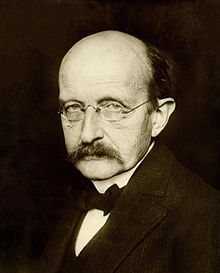

<table class="infobox biography vcard">
<tbody>
<tr>
<th colspan="2">

Max Karl Planck

 

<a class="mw-redirect" title="Foreign Member of the Royal Society" href="https://en.wikipedia.org/wiki/Foreign_Member_of_the_Royal_Society">ForMemRS</a>

</th>
</tr>
<tr>
<td colspan="2">

Planck in 1933

</td>
</tr>
<tr>
<th scope="row">Born</th>
<td>

Max Karl Ernst Ludwig Planck

 23 April 1858 

<a title="Kiel" href="https://en.wikipedia.org/wiki/Kiel">Kiel</a>,&nbsp;<a title="Duchy of Holstein" href="https://en.wikipedia.org/wiki/Duchy_of_Holstein">Duchy of Holstein</a>

</td>
</tr>
<tr>
<th scope="row">Died</th>
<td>4 October 1947&nbsp;(aged&nbsp;89) 

<a title="G&ouml;ttingen" href="https://en.wikipedia.org/wiki/G%C3%B6ttingen">G&ouml;ttingen</a>,&nbsp;<a title="Lower Saxony" href="https://en.wikipedia.org/wiki/Lower_Saxony">Lower Saxony</a>,&nbsp;<a title="Allied-occupied Germany" href="https://en.wikipedia.org/wiki/Allied-occupied_Germany">Allied-occupied Germany</a>

</td>
</tr>
<tr>
<th scope="row">Alma&nbsp;mater</th>
<td><a title="Ludwig Maximilian University of Munich" href="https://en.wikipedia.org/wiki/Ludwig_Maximilian_University_of_Munich">Ludwig Maximilian University of Munich</a></td>
</tr>
<tr>
<th scope="row">Known&nbsp;for</th>
<td>

<ul>
<li><a title="Planck constant" href="https://en.wikipedia.org/wiki/Planck_constant">Planck constant</a></li>
<li><a title="Planck postulate" href="https://en.wikipedia.org/wiki/Planck_postulate">Planck postulate</a></li>
<li><a class="mw-redirect" title="Planck's law of black body radiation" href="https://en.wikipedia.org/wiki/Planck%27s_law_of_black_body_radiation">Planck's law of black body radiation</a></li>
<li><a title="Fokker&ndash;Planck equation" href="https://en.wikipedia.org/wiki/Fokker%E2%80%93Planck_equation">Fokker&ndash;Planck equation</a></li>
<li><a title="Nernst&ndash;Planck equation" href="https://en.wikipedia.org/wiki/Nernst%E2%80%93Planck_equation">Nernst&ndash;Planck equation</a></li>
<li><a title="Third law of thermodynamics" href="https://en.wikipedia.org/wiki/Third_law_of_thermodynamics">Third law of thermodynamics</a></li>
</ul>

</td>
</tr>
<tr>
<th scope="row">Spouse(s)</th>
<td>

Marie Merck

(<abbr title="married">m.</abbr>&nbsp;1887; died&nbsp;1909)<wbr />

Marga von H&ouml;sslin

&nbsp;

(<abbr title="married">m.</abbr>&nbsp;1911)<wbr />

</td>
</tr>
<tr>
<th scope="row">Children</th>
<td>5</td>
</tr>
<tr>
<th scope="row">Awards</th>
<td>

<ul>
<li><a title="Nobel Prize in Physics" href="https://en.wikipedia.org/wiki/Nobel_Prize_in_Physics">Nobel Prize in Physics</a>&nbsp;(1918)</li>
<li><a class="mw-redirect" title="Foreign Associate of the National Academy of Sciences" href="https://en.wikipedia.org/wiki/Foreign_Associate_of_the_National_Academy_of_Sciences">Foreign Associate of the National Academy of Sciences</a>&nbsp;(1926)</li>
<li><a title="Lorentz Medal" href="https://en.wikipedia.org/wiki/Lorentz_Medal">Lorentz Medal</a>&nbsp;(1927)</li>
<li><a title="Copley Medal" href="https://en.wikipedia.org/wiki/Copley_Medal">Copley Medal</a>&nbsp;(1929)</li>
<li><a title="Max Planck Medal" href="https://en.wikipedia.org/wiki/Max_Planck_Medal">Max Planck Medal</a>&nbsp;(1929)</li>
<li><a title="Goethe Prize" href="https://en.wikipedia.org/wiki/Goethe_Prize">Goethe Prize</a>&nbsp;(1945)</li>
</ul>

</td>
</tr>
<tr>
<td colspan="2"><strong>Scientific career</strong></td>
</tr>
<tr>
<th scope="row">Fields</th>
<td class="category"><a title="Physics" href="https://en.wikipedia.org/wiki/Physics">Physics</a></td>
</tr>
<tr>
<th scope="row">Institutions</th>
<td>

<ul>
<li><a title="University of Kiel" href="https://en.wikipedia.org/wiki/University_of_Kiel">University of Kiel</a></li>
<li><a title="University of G&ouml;ttingen" href="https://en.wikipedia.org/wiki/University_of_G%C3%B6ttingen">University of G&ouml;ttingen</a></li>
<li><a title="Kaiser Wilhelm Society" href="https://en.wikipedia.org/wiki/Kaiser_Wilhelm_Society">Kaiser Wilhelm Society</a></li>
</ul>

</td>
</tr>
<tr>
<th scope="row"><a title="Thesis" href="https://en.wikipedia.org/wiki/Thesis">Thesis</a></th>
<td><em>On the Second Principles of Mechanical Heat Theory</em>&nbsp;(1879)</td>
</tr>
<tr>
<th scope="row"><a title="Doctoral advisor" href="https://en.wikipedia.org/wiki/Doctoral_advisor">Doctoral advisor</a></th>
<td>

<ul>
<li><a title="Alexander von Brill" href="https://en.wikipedia.org/wiki/Alexander_von_Brill">Alexander von Brill</a></li>
<li><a title="Gustav Kirchhoff" href="https://en.wikipedia.org/wiki/Gustav_Kirchhoff">Gustav Kirchhoff</a></li>
<li><a title="Hermann von Helmholtz" href="https://en.wikipedia.org/wiki/Hermann_von_Helmholtz">Hermann von Helmholtz</a></li>
</ul>

</td>
</tr>
<tr>
<th scope="row">Doctoral students</th>
<td>

<ul>
<li><a title="Erich Kretschmann" href="https://en.wikipedia.org/wiki/Erich_Kretschmann">Erich Kretschmann</a></li>
<li><a title="Gustav Ludwig Hertz" href="https://en.wikipedia.org/wiki/Gustav_Ludwig_Hertz">Gustav Ludwig Hertz</a></li>
<li><a title="Julius Edgar Lilienfeld" href="https://en.wikipedia.org/wiki/Julius_Edgar_Lilienfeld">Julius Edgar Lilienfeld</a></li>
<li><a title="Max Abraham" href="https://en.wikipedia.org/wiki/Max_Abraham">Max Abraham</a></li>
<li><a title="Max von Laue" href="https://en.wikipedia.org/wiki/Max_von_Laue">Max von Laue</a></li>
<li><a title="Moritz Schlick" href="https://en.wikipedia.org/wiki/Moritz_Schlick">Moritz Schlick</a></li>
<li><a title="Walter H. Schottky" href="https://en.wikipedia.org/wiki/Walter_H._Schottky">Walter Schottky</a></li>
<li><a title="Walther Bothe" href="https://en.wikipedia.org/wiki/Walther_Bothe">Walther Bothe</a></li>
<li><a title="Walther Meissner" href="https://en.wikipedia.org/wiki/Walther_Meissner">Walther Meissner</a></li>
<li><a title="Richard Becker (physicist)" href="https://en.wikipedia.org/wiki/Richard_Becker_(physicist)">Richard Becker</a></li>
</ul>

</td>
</tr>
<tr>
<th scope="row">Other&nbsp;notable students</th>
<td>

<ul>
<li><a title="Wolfgang K&ouml;hler" href="https://en.wikipedia.org/wiki/Wolfgang_K%C3%B6hler">Wolfgang K&ouml;hler</a></li>
<li><a title="Lise Meitner" href="https://en.wikipedia.org/wiki/Lise_Meitner">Lise Meitner</a></li>
</ul>

</td>
</tr>
<tr>
<th colspan="2">Signature</th>
</tr>
<tr>
<td colspan="2"></td>
</tr>
</tbody>
</table>
 

<strong>Max Karl Ernst Ludwig Planck</strong>,&nbsp;<a class="mw-redirect" title="Foreign Member of the Royal Society" href="https://en.wikipedia.org/wiki/Foreign_Member_of_the_Royal_Society">ForMemRS</a>&nbsp;(23 April 1858 &ndash; 4 October 1947) was a German&nbsp;<a class="mw-redirect" title="Theoretical physicist" href="https://en.wikipedia.org/wiki/Theoretical_physicist">theoretical physicist</a>&nbsp;whose discovery of&nbsp;<a title="Quantum mechanics" href="https://en.wikipedia.org/wiki/Quantum_mechanics">energy quanta</a>&nbsp;won him the&nbsp;<a title="Nobel Prize in Physics" href="https://en.wikipedia.org/wiki/Nobel_Prize_in_Physics">Nobel Prize in Physics</a>&nbsp;in 1918.

Planck made many contributions to theoretical physics, but his fame as a physicist rests primarily on his role as the originator of&nbsp;<a title="Quantum mechanics" href="https://en.wikipedia.org/wiki/Quantum_mechanics">quantum theory</a>,&nbsp;which revolutionized human understanding of atomic and subatomic processes. In 1948, the German scientific institution&nbsp;<a title="Kaiser Wilhelm Society" href="https://en.wikipedia.org/wiki/Kaiser_Wilhelm_Society">Kaiser Wilhelm Society</a>&nbsp;(of which Planck was twice president) was renamed&nbsp;<a title="Max Planck Society" href="https://en.wikipedia.org/wiki/Max_Planck_Society">Max Planck Society</a>&nbsp;(MPS). The MPS now includes 83 institutions representing a wide range of scientific directions.

 

<strong> Publications: </strong>

<ul>

 <li><a target="_blank" href="https://github.com/manjunath5496/Max-Planck-Papers/blob/master/tst(15).pdf" style="text-decoration:none;">Scientific Autobiography and other papers</a></li>
                            
 <li><a target="_blank" href="https://github.com/manjunath5496/Max-Planck-Papers/blob/master/tst(16).pdf" style="text-decoration:none;">Treatise on Thermodynamics</a></li>

<li><a target="_blank" href="https://github.com/manjunath5496/Max-Planck-Papers/blob/master/tst(17).pdf" style="text-decoration:none;">Eight lectures on theoretical physics, delivered at Columbia University in 1909</a></li>
 <li><a target="_blank" href="https://github.com/manjunath5496/Max-Planck-Papers/blob/master/tst(18).pdf" style="text-decoration:none;">The Philosophy of Physics</a></li>                              

 <li><a target="_blank" href="https://github.com/manjunath5496/Max-Planck-Papers/blob/master/tst(19).pdf" style="text-decoration:none;">The Universe In The Light Of Modern Physics</a></li>
                            
 <li><a target="_blank" href="https://github.com/manjunath5496/Max-Planck-Papers/blob/master/tst(20).pdf" style="text-decoration:none;">Where Is Science Going?</a></li>

<li><a target="_blank" href="https://github.com/manjunath5496/Max-Planck-Papers/blob/main/p(1).pdf" style="text-decoration:none;">On the Law of the Energy Distribution
in the Normal Spectrum</a></li>

 <li><a target="_blank" href="https://github.com/manjunath5496/Max-Planck-Papers/blob/main/p(2).pdf" style="text-decoration:none;">On the Theory of the Energy Distribution Law of the Normal Spectrum</a></li>

<li><a target="_blank" href="https://github.com/manjunath5496/Max-Planck-Papers/blob/main/p(3).pdf" style="text-decoration:none;">On an Improvement of Wien's Equation for the Spectrum</a></li>
 <li><a target="_blank" href="https://github.com/manjunath5496/Max-Planck-Papers/blob/main/p(4).pdf" style="text-decoration:none;">The Theory of Heat Radiation</a></li>                              

</ul>
